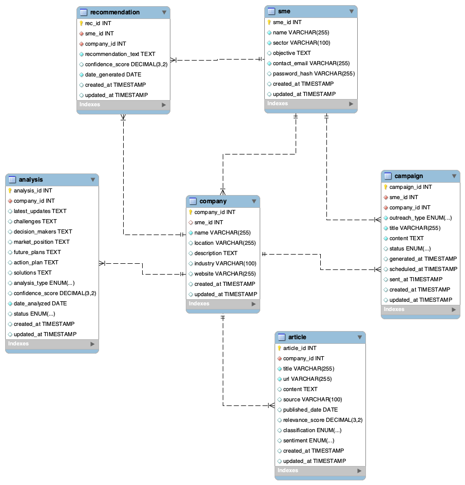

# I.N.S.P.I.R.E.
### Intelligent Network System for Partnerships, Insights, Research & Expansion  
**AI-powered B2B Intelligence Platform for MSMEs in Rwanda**

---

## Table of Contents

- [Project Overview](#project-overview)
- [Core Features](#core-features)
- [System Architecture](#system-architecture)
- [Installation & Setup](#installation--setup)
    - [Backend Setup](#backend-setup)
    - [Frontend Setup](#frontend-setup)
- [Running the App](#running-the-app)
- [Demo Video (5 Minutes)](#demo-video-5-minutes)
- [Related Files](#related-files)
- [Project Structure](#project-structure)
- [License](#license)

---

## Project Overview

**I.N.S.P.I.R.E.** delivers actionable intelligence and data-driven insights for MSMEs by integrating multiple data sources, advanced AI/ML models, and an intuitive web-based dashboard.  
**Core:** Powerful data scraping, classification, summarization, company profiling, market analysis & recommendations, all tailored for the Rwandan MSME ecosystem.

---

## Core Features

### Focused Intelligence for MSMEs:
- **Automated Article Classification (95.2% accuracy)**
- **AI-Powered Text Summarization** (batch & real-time)
- **Company Intelligence Extraction** via advanced NER & custom scrapers
- **Comprehensive Company Profile Generation**, including multi-source aggregation & enrichment
- **Comprehensive & Unified Analysis**:  
  - In-depth, LLM-based answers to 7 key business questions
  - Cross-source data synthesis for actionable recommendations
- **Automated Outreach Campaigns**:  
  - Define, generate, and monitor outreach to target companies
- **INSPIRE Data Platform**:  
  - Explore, search, and manage SME, company, article, campaign, recommendation, and analysis databases
- **Advanced Data Visualization Dashboard**
- **Modern, Responsive B2B Web App**

---

## System Architecture

- **Backend**: FastAPI, Celery, SQLAlchemy, MySQL/Postgres, Redis, advanced scraping (Playwright, Selenium, Apify, SerpAPI), ML/AI (HuggingFace, sklearn, etc.)
- **Frontend**: React (Vite, MUI, Tailwind, ChartJS), fully protected routes, campaign/notification system, integrated dashboards



---

## Installation & Setup

### Prerequisites
- Node.js >= 18.x, npm
- Python >= 3.10, pip
- MySQL or PostgreSQL
- Redis

### Backend Setup
```bash
cd /Users/samenergy/Desktop/Cappp/Backend
python -m venv venv
source venv/bin/activate
pip install -r requirements.txt
# Edit .env file for DB and other secrets (template in app/config.py or docs)
alembic upgrade head        # Run DB migrations, if needed
uvicorn app.main:app --reload  # Local development server: http://localhost:8000
```

### Frontend Setup
```bash
cd /Users/samenergy/Desktop/Cappp/Frontend
npm install
npm run dev    # Local: http://localhost:3000
```

## Running the App (Summary)

- **Backend:**  
  Start FastAPI: `uvicorn app.main:app --reload`
- **Frontend:**  
  Start development server: `npm run dev`

## Demo Video (5 Minutes)

*A 5-minute demo recording is available here: [[ADD YOUR VIDEO LINK HERE](https://www.youtube.com/watch?v=1FpCMQ7yAhA)]*  
<!-- Please add a link to a Loom/YouTube or similar hosted walkthrough. -->

---

## Related Files

- Backend API:  
    - `/Backend/app/main.py`, `/Backend/app/routers/*`, `/Backend/app/services/*`, `/Backend/app/models.py`
- AI/ML Models:  
    - `/Backend/ml_models/`, `/Backend/app/services/*`
- Frontend Main:  
    - `/Frontend/src/App.tsx`, `/Frontend/src/components/`
- Data/ER Diagram:  
    - `ERD.png`
- Backend dependencies: `requirements.txt`
- Frontend dependencies: `package.json`
- Configuration: `.env`, `config.py`
- Database scripts: `/Backend/app/database_*`
- Notebooks: `/Backend/notebooks/`

---

## Project Structure

```
Cappp/
│
├── Backend/
│   ├── app/
│   │    ├── main.py
│   │    ├── routers/       # ALL business logic endpoints
│   │    ├── services/      # NLP, scraping, AI/ML, PDF, etc.
│   │    ├── models.py
│   ├── ml_models/          # Trained classifiers, LLM configs
│   ├── requirements.txt
│   └── ...
├── Frontend/
│   ├── src/
│   ├── package.json
│   └── ...
├── ERD.png                 # Data model overview
└── ...
```
